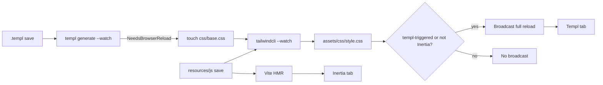

# Dual CSS pipelines for Inertia + Templ

Templ pages always load compiled `assets/css/style.css` (proxy-rewritten to disk via `/__shadowfax/assets/...`). Inertia pages get CSS from Vite (`@tailwindcss/vite`). Today Shadowfax turns the CLI watcher off whenever `--inertia` is set, so that compiled file stays empty and Templ views look unstyled.

```134:136:cmd/shadowfax/main.go
	// Inertia apps use @tailwindcss/vite; the CLI watcher would full-reload
	// the tab and fight Vite HMR.
	useTailwindCLI := useTailwind && !useInertia
```




## Change in [cmd/shadowfax/main.go](cmd/shadowfax/main.go)

1. **Always start the CLI watcher when `css/base.css` exists.** Replace `useTailwind && !useInertia` with `useTailwind` (from existing `[config.ShouldUseTailwind](internal/config/lock.go)`). Keep touching `./css/base.css` on both `TemplChangeNeedsBrowserReload` and `TemplChangeNeedsRestart`.
2. **Gate the CSS-rebuild broadcast with a pending-Templ flag.**
  - `atomic.Bool` (e.g. `templPendingCSSReload`).
  - Set it **before** `touchFile` on `TemplChangeNeedsBrowserReload`.
  - Do **not** set it on `TemplChangeNeedsRestart` (Go rebuild already reloads after health; `rebuildInProgress` already suppresses CSS broadcasts).
  - CSS-rebuild handler:
    - `Swap(false)` the flag first so a swallowed/blocked rebuild cannot leak into a later JS-driven rebuild.
    - Broadcast only if `!reloadBlocked()` **and** (`!useInertia` **or** flag was set).
    - If `touchFile` fails on a Templ content change, keep the current fallback: broadcast immediately and clear the flag.
3. **Extract the decision** into a small helper (same package as `main`) so tests assert the matrix instead of copying the goroutine:
  - non-Inertia + any CSS rebuild → broadcast
  - Inertia + CSS rebuild, flag unset → silent
  - Inertia + CSS rebuild, flag set → broadcast
  - reload blocked → no broadcast, flag cleared

Existing tests in [cmd/shadowfax/main_test.go](cmd/shadowfax/main_test.go) (`TestCSSRebuiltBroadcastsWhenIdle`, `TestCSSRebuiltSuppressedDuringRestart`, `TestFullRestartCycle`) should call that helper / the real handler so they stay truthful.

## Docs in [README.md](README.md)

Update the Tailwind section and the “How It Works” bullets that currently say CLI watching is off with `--inertia`:

- CLI watch runs whenever `css/base.css` exists, including Inertia apps.
- It writes `assets/css/style.css` for Templ pages (welcome, errors, generated resources).
- Inertia JS still uses Vite HMR; Shadowfax only full-reloads on Templ-triggered CSS rebuilds.

## Out of scope (do not change here)

- Andurel `css/base.css` `@source` paths resolving relative to `css/` (auto-detect from CWD still finds `.templ` classes).
- Andurel scaffolding an empty `assets/css/style.css` / first `cmd/app` embed race. After this change the proxy still serves the on-disk file, so the first Tailwind compile is enough for the next Templ load; compiling CSS *before* the first Go build stays an Andurel concern.
